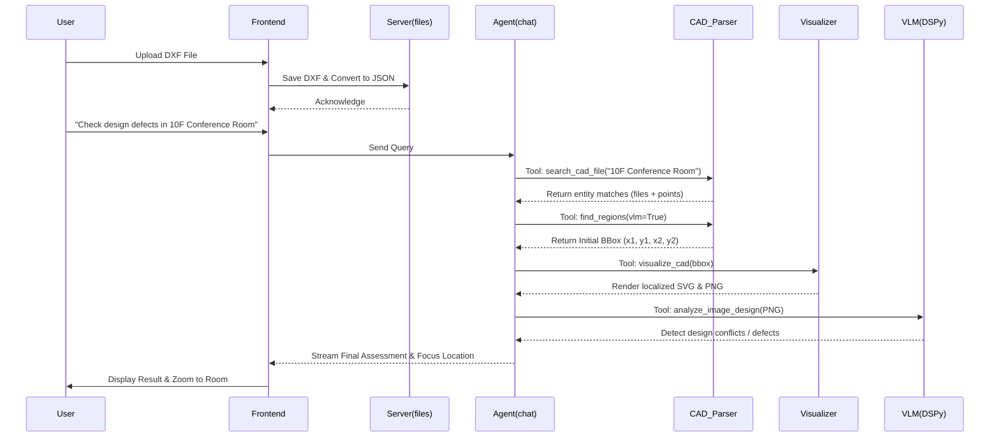

# CAD AI Project - Technical Architecture Report

## 1. Executive Summary

This report provides a comprehensive technical overview of the CAD AI Agent Project, covering the backend (`src/` & `server/`), frontend (`frontend/`), and the underlying hybrid architecture that integrates Text Parsing with Just-In-Time (JIT) Rasterization. It outlines the data flow from initial CAD upload to final Vision Language Model (VLM) analysis and details the Agent orchestration logic responsible for reliable vision tool activation.

---

## 2. Directory Structure Overview

### 2.1 Backend Core (`src/`)
The `src/` directory houses the core reasoning, extraction, and rasterization logic.
* **`chat.py`**: The central orchestrator that manages tool execution (e.g., `search_cad_file`, `find_regions`, `visualize_cad`), context pruning, tool output summarization, and task delegation (`delegate_to_agent`).
* **`extract_roi_data.py`**: Handles text and entity extraction from JSON-converted CAD files. It implements token-saving minification logic (`minify_for_llm`) and coordinate rounding.
* **`visualize_cad.py`**: Converts semantic JSON CAD data within a given bounding box into a highly-accurate SVG using Matplotlib.
* **Localization Scripts (`occupancy_grids.py`, `vector.py`)**: Responsible for initial bounding box generation. `occupancy_grids.py` builds grid maps of structural elements to isolate large-scale general drawings (e.g., full floor plans), while `vector.py` uses text seeding and vector matching (slot detection + connected components) to precisely extract localized sub-regions (e.g., specific rooms).
* **VLM Scripts (`multi_layout_vlm.py`, `refine_bbox_vlm.py`, `padding_vlm.py`, `cropping_vlm.py`)**: Uses DSPy to classify layout structures, split multi-layout drawings, and conditionally pad or crop bounding boxes before final analysis.
* **`image_analysis.py`**: A unified visual analyzer leveraging DSPy Signatures (`ImageAnalysisSignature`, `DesignDefectSignature`, `ComplianceAnalysisSignature`) to run detailed design defect analysis, safety/accessibility compliance checking, and exhaustive spatial descriptions on generated PNGs. It produces highly structured outputs suitable for downstream reasoning.

### 2.2 FastAPI Server (`server/`)
The `server/` directory implements the REST/SSE API connecting the frontend UI to the backend agent.
* **`main.py`**: Configures the FastAPI application, sets up CORS, and includes the routers.
* **`routers/`**:
  * **`chat.py`**: Exposes the SSE endpoint for streaming LLM responses and tool execution updates.
    * `POST /api/chat` (or similar streaming endpoint): Accepts a user query and history, initiates the `run_agent` reasoning loop, and yields Server-Sent Events (SSE) including `token`, `task_start`, and `task_complete` to stream real-time updates.
  * **`search.py`**: Exposes endpoints for textual and bounding box queries.
    * `POST /search/text`: Queries CAD JSON files for specific text strings.
    * `POST /search/bbox`: Queries for entities intersecting a specified bounding box.
    * `POST /search/point`: Queries for entities containing a specific (x, y) coordinate.
    * `GET /search/files`: Lists available parsed CAD JSON files in `storage/json`.
  * **`files.py`**: Manages the persistence of uploaded DXF files and generated SVG/PNG assets.
    * `POST /api/save-dxf-file`: Handles raw `.dxf` uploads to `storage/dxf/`.
    * `POST /api/save-dxf-data`: Saves the browser-parsed semantic JSON representation to `storage/json/`.
    * `GET /api/stored-dxf-files`: Lists all raw DXF files.
    * `GET /api/dxf-files` / `GET /api/latest-dxf`: Retrieves stored parsed JSON CAD files.
    * `GET /api/dxf-file/{filename}`: Downloads a specific DXF file.
    * *(Note: also manages SVG file persistence endpoints like `GET /api/stored-svg-files` and `GET /api/svg-file/{filename}`)*

### 2.3 Frontend UI (`frontend/`)
The `frontend/` directory contains the Vue.js 3 application built with Quasar Framework, providing a highly interactive, IDE-like workspace for CAD analysis.

* **API Configuration (`src/config.js`)**: The frontend communicates with the FastAPI backend through a globally configured `apiBaseUrl`, which is injected at build/runtime via the `FASTAPI_API_URL` environment variable (e.g., `http://localhost:8000`). All `fetch` and SSE requests within the Vue components rely on this configuration to locate the server.
* **`App.vue`**: The root component managing the main workspace layout. It handles the dynamic file tab system (allowing multiple DXF files to be open simultaneously), top-level toolbars, and global state management (like tracking the active file and view modes). It also integrates a hidden file input for dragging/dropping local DXF uploads.
* **`ViewerPage.vue`**: The core structural view for the active tab. It organizes the screen into three areas:
  * **Left Sidebar**: Displays the file explorer, SVG gallery, layer toggles, and property panels.
  * **Center Area**: Houses the actual CAD renderer (`DxfViewer.vue`), AAG graph visualizations, and the interactive Command Line input.
  * **Right Sidebar**: Contains the AI Assistant chat interface.
* **`DxfViewer.vue`**: A wrapper around the `dxf-viewer` library (which uses Three.js). It handles the actual WebGL rendering of the CAD file. It runs computationally heavy parsing on a background thread (`DxfViewerWorker.js`) and implements an interactive "focus" mechanism, allowing the UI to zoom and pan to specific `(x, y)` coordinates discovered by the backend agent.
* **`AiAssistant.vue`**: The chat interface communicating with the backend via SSE (`/api/chat/stream`). It features a custom Markdown renderer that natively formats and collapses agent tool executions (`tool_start`, `tool_result`), providing the user with real-time insight into the agent's multi-hop reasoning without cluttering the chat view.

---

## 3. Hybrid Architecture: Text Parsing + JIT Rasterization

The system avoids the computationally prohibitive task of rasterizing the entire CAD drawing at high resolutions by adopting a **Hybrid Architecture**:

1. **Text Parsing (Semantic Discovery):**
   * **Ingestion:** Uploaded DXF files are pre-processed into a minified, token-optimized JSON format.
   * **Search:** High-level spatial queries (e.g., "Find the 10th-floor conference room") are routed through `search_cad.py` (via the `search_cad_file` tool).
   * **Bounding Box Calculation:** Once a target label is found, the system dynamically computes an ROI using `occupancy_grids.py` (for large, general plan structures) or `vector.py` (which matches text seeds to local vector boundaries using 1D slot detection and connected components).
2. **JIT Rasterization (Visual Rendering):**
   * Once a precise bounding box is identified semantically, the system dynamically rasterizes *only* that localized area.
   * **`visualize_cad.py`** extracts entities within the ROI and generates a localized SVG using Matplotlib (with appropriate CJK font injection for text rendering).
   * The SVG is converted to a high-fidelity PNG using the `resvg` CLI (via `svg2image.py`), ready for VLM ingestion.

---

## 4. Data Flow: CAD Upload to Final Vision Analysis



---

## 5. Agent Orchestration (`chat.py`) & Vision Tool Activation

The system orchestrator (`src/chat.py`) is the brain of the CAD AI Agent. It employs a multi-hop, fail-fast reasoning loop designed to handle complex, multi-step CAD queries safely and efficiently.

### 5.1 Core Orchestration Mechanics (`chat.py`)
* **Multi-Hop Reasoning Engine:** The orchestrator continuously evaluates the user's query, selects appropriate tools from a predefined registry (`MAP_FN`), executes them, and feeds the results back into the LLM context until the task is complete.
* **Context & Token Management:** 
  * **Auto-Summarization:** Large tool outputs exceeding the `TOOL_OUTPUT_SUMMARY_THRESHOLD` (e.g., massive JSON dumps) are automatically summarized by a secondary LLM call to extract key facts, file paths, and coordinates without polluting the main context window.
  * **Spooling:** Absurdly large outputs (`> MAX_SUMMARIZE_LENGTH`) are written to temporary files on disk (`storage/tmp/`), returning only a file path and a preview to the agent, allowing it to read specific chunks using terminal commands.
  * **Sliding Window Pruning:** The message history is strictly trimmed to the system prompt plus the last 30 turns to prevent context window overflow during prolonged reasoning sessions.
* **Safe Python Execution Sandbox:** The agent is equipped with a `python` tool for custom CAD entity extraction and mathematical computations. `chat.py` wraps this execution in a sandbox (`safe_import`), blocking dangerous system calls while pre-injecting `cad_utils` and math libraries directly into the global namespace.
* **Hierarchical Delegation & Memory:** 
  * Ambiguous or highly complex queries trigger `delegate_to_agent`, spawning specialized sub-agents with distinct system prompts (e.g., `file_triage_agent`). 
  * Persistent State Management (`save_to_memory`, `read_memory`) allows the agent to write scratchpad data to memory, surviving multi-turn logic leaps.
* **Parallel Execution:** When the LLM requests multiple independent tool calls simultaneously, `chat.py` leverages a `ThreadPoolExecutor` to run them in parallel, drastically reducing latency.

### 5.2 Hardcoded Workflow & Tool Enforcement
1. **Mandatory Sequence Enforcement**: The orchestrator enforces strict workflows. If a user asks for visual analysis, the Agent cannot blindly guess coordinates. It MUST use `search_cad_file` first to discover text entities.
2. **Localization & Bounding Box Extraction (`find_regions`)**: After text discovery, the Agent calls `find_regions`. Under the hood, this relies on a multi-hop localization logic:
   * **Plan & Layout Extraction**: Large-scale, general drawings (floor plans, sections) are isolated using `occupancy_grids.py`, which builds a structural occupancy grid to bound the full plan.
   * **Specific Sub-Region Extraction**: For localized spaces (e.g., a specific room), `vector.py` takes a text seed, performs 1D slot detection, and applies connected component (CC) refinement to isolate just that space.
3. **VLM Refinement Pipeline**:
   * If `vlm=True` is passed, `find_regions` routes the raw ROI through `refine_bbox_vlm.py`.
   * The initial semantic bbox is temporarily rasterized.
   * DSPy-powered VLM modules evaluate the image to determine if structural boundaries are cleanly cut.
   * **Padding/Cropping:** If walls are cut off on general plans, `padding_vlm.py` expands the bbox. If there is excessive whitespace around sub-regions, `cropping_vlm.py` shrinks it.
4. **Visual Activation (`visualize_cad` & `analyze_image_*`)**: 
   * Once the precise, refined bbox is returned, the Agent explicitly calls `visualize_cad` to generate the final image asset.
   * Finally, `image_analysis.py` is invoked (`analyze_image_design`, `analyze_image_compliance`, or `analyze_image_description`). These tools use explicit DSPy Signatures (e.g., `DesignDefectSignature`, `ComplianceAnalysisSignature`) to structure the multimodal LLM output, extracting defect types, severities, locations, and providing exhaustive architectural descriptions.

### 5.3 Context Pruning and Loop Prevention
* **Fail-Fast Discovery:** The orchestrator mandates Batch Discovery rather than iterative guessing. If an assumption or target keyword fails during `search_cad_file`, the sub-agent aborts and returns the failure context immediately, preventing infinite loops.

---

## 6. Key Agent Tool Interfaces (Inputs & Outputs)

To facilitate multi-hop reasoning, the agent interacts with several core tool functions. Below are the primary input parameters and expected output formats for the most critical tools, ordered by their typical execution flow during a visual analysis task.

### 6.1 Discovery Phase: `search_cad_file(command, query, paths)`
**Purpose:** Discovers which CAD JSON files contain specific text or intersect spatial coordinates. This is always the first step to establish semantic grounding.
* **Inputs:**
  * `command` (str): Specifies search mode (`"text"`, `"bbox"`, or `"point"`).
  * `query` (str | list): The keyword(s) to search for (e.g., `"Conference Room"`).
  * `paths` (list): Directories or files to restrict the search (default: `storage/json`).
* **Expected Output:** JSON summary grouping hits by file and keyword.
  ```json
  [
    {
      "file": "storage/json/floor_10.json",
      "total_hits": 2,
      "hits_by_keyword": {"Conference Room": 2}
    }
  ]
  ```

### 6.2 Localization Phase: `refine_bbox_vlm.py` (Engine behind `find_regions`)
**Purpose:** Once the target file is discovered, this script isolates the exact spatial region (Bounding Box). It orchestrates query classification, semantic routing, spatial filtering, and optional visual refinement.
* **Internal Workflow:**
  1. **Query Classification:** Uses a lightweight LLM (`QueryClassificationSignature`) to classify the `target_keyword` as either a `"general drawing"` (e.g., "1st Floor Plan") or a `"sub-region"` (e.g., "Conference Room").
  2. **Semantic Routing:** Based on the classification, it delegates the initial geometric extraction to either `occupancy_grids.py` (general plans) or `vector.py` (sub-regions).
  3. **Spatial Filtering & Outlier Rejection:** If a `--layout` constraint is provided, it filters out bounding boxes that do not intersect with the parent layout. It also merges overlapping matches and rejects dominant outliers.
  4. **VLM Refinement (Lazy Execution):** If the `--vlm` flag is passed, it temporarily rasterizes the initial bounding box to PNG and feeds it to DSPy Vision Signatures (`PaddingDecisionSignature` and `CroppingDecisionSignature`). These visually verify if edges are cut off (requiring padding) or contain excess whitespace (requiring cropping), adjusting the coordinates dynamically.
  5. **Spatial Memory:** Saves the resolved coordinates into a local `spatial_memory.json` cache to accelerate future requests.
* **CLI Inputs:**
  * `--file` (str): Path to the CAD JSON file.
  * `--target_keyword` (str): The entity to locate.
  * `--layout` (str, optional): Parent region to constrain the search spatially.
  * `--vlm` (flag): Triggers the heavy visual boundary refinement pipeline.
* **Expected Output:** Diagnostic logs followed by a strict JSON array marker containing the resolved coordinates.
  ```json
  --- Final Refined Bounding Boxes ---
  [
    {
      "min_x": 10500.0, "min_y": 2000.0,
      "max_x": 15000.0, "max_y": 8000.0
    }
  ]
  ```

### 6.3 Rendering Phase: `visualize_cad(file_path, bbox, output)`
**Purpose:** After the bounding box is successfully isolated and refined, this tool generates a localized SVG rendering from the semantic JSON data, explicitly framing the region of interest for visual inspection.
* **Inputs:**
  * `file_path` (str): The CAD JSON file.
  * `bbox` (str): Comma-separated coordinate string `"min_x,min_y,max_x,max_y"`.
  * `output` (str): The desired filename/path for the generated image.
* **Expected Output:** Text string confirming successful SVG generation.
  ```text
  Visualization successfully saved to: storage/images/conference_room.svg
  ```

### 6.4 Visual Analysis Phase: `image_analysis.py` (e.g., `analyze_image_design`)
**Purpose:** The final step. Takes the rasterized CAD image and uses a Vision Language Model (via DSPy) to perform structured architectural analysis (identifying design defects, checking code compliance, or producing descriptive analyses).
* **Inputs (Python API):**
  * `image_path` (str): Path to the generated PNG/SVG image.
  * `context` (str): Supplementary metadata (e.g., "10th-floor plan, checking for structural clashes").
  * `query` (str): Specific defect analysis instructions.
* **Expected Output:** JSON array of structured objects conforming to the respective DSPy Signature (e.g., `DesignDefectSignature`).
  ```json
  [
    {
      "id": 1,
      "type": "Structural Clash",
      "description": "Column intersects with the main corridor pathway.",
      "location": "Grid C-4",
      "severity": "High",
      "how_to_fix": "Relocate column 500mm to the north."
    }
  ]
  ```
